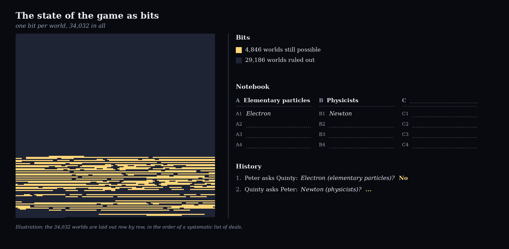
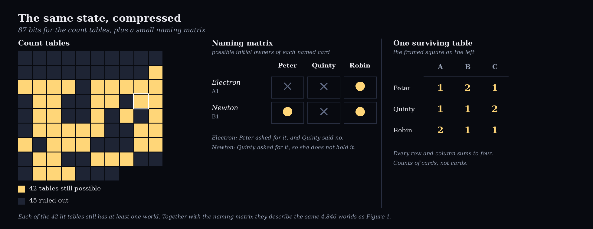
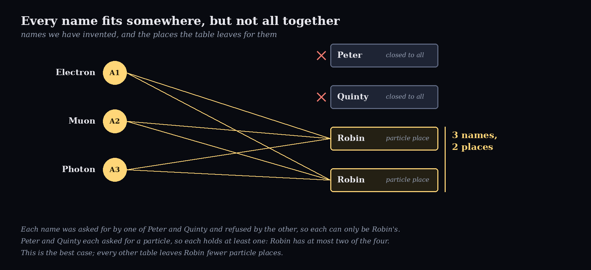

# A Card Game With Cards That Don't Exist (Yet)

*A blind version of the children's game kwartet has 34,032 possible worlds. Keeping track of them leads to a marriage theorem from 1935.*

*Feature image: four cards, one of which has just received its name.*

## Kwartet Without Cards Always Ends in Confusion

Imagine a card game in which no card exists. Not only does no one hold a physical card, but also what is actually on the virtual cards we play with is not yet defined. The cards are made up as you play. The rule is that you are not allowed to make a move that is inconsistent with what happened earlier in the game.

I got to know this game when a friend proposed it while we were travelling with some fellow students to a physics conference in the mid-1990s. It was fun, but it always ended in confusion: after a few rounds it became almost impossible to track the history and determine what was still a legal move.

The game is based on the Dutch children's game Kwartet, which is very similar to Go Fish. Players assemble the four cards of a category by asking other players for them. Once you have a complete category you say "Kwartet" and lay down the cards. When you ask for a card you have to be specific ("Can you give me Archimedes from the Greek mathematicians?"). If the other player has the card, it is handed over and you can ask again. If not, it is their turn. You may only ask for a card from a category in which you already hold a card, and never for a card you hold yourself.

In our variant we only fixed how many cards were in the game, how many each player held initially, and the fact that nobody had a kwartet from the start. Then the first question ("Can you give me the electron from the elementary particles?") defined a category (the elementary particles) and one member of that category (the electron). But the question also told us that the first player held at least one other card from the elementary particles, but not the electron. The second player could answer yes or no. Depending on the answer, the card was virtually handed over, or the turn moved to the second player. After a few questions multiple categories were defined, with partially identified members, and a list of constraints on the players' hands emerged. This is where we got lost. 

To add to the confusion, we could never resist complicating the categories: if someone defined Newton as a physicist, someone else would define a Newton as a unit. But aside from that, is there a way to efficiently manage this bookkeeping and discover whether a move is still legal, given what happened before?

## Give the Blank Cards Secret Labels

We can keep track of the game by giving each virtual card initially a label. Call the three categories A, B and C, and the cards A1 to A4, B1 to B4 and C1 to C4 (you could imagine that a printer had labelled the deck before the game). We then agree that the first category mentioned is category A, and that the first card in any category gets the label 1. In this situation the names the players invent ("Elementary particles", "Electron") are only entries in a notebook that matches the labels on the cards as the game evolves.

With these labels, the question "what is still possible?" becomes a question we can answer by assessing whether the game state is consistent with a valid initial state. We can take each possible initial state as a world: one complete deal of the twelve labelled cards: who holds which card at the start. With three players holding four cards each, there are 12! / (4!)³ = 34,650 ways to deal. In 618 of them somebody starts with a complete category, which the rules exclude, so 34,032 worlds remain. That is our multiverse: every deal consistent with the rules before the first question is asked. In each world the game then evolves as the players ask and answer questions, and as cards change owner.

Now the referee has a simple job. Give every world one bit, switched on. Every question, answer, transfer and announcement switches off the worlds that contradict it. As long as at least one bit is still on, the game so far is legal. If the last bit goes off, someone made an impossible move.

Note what this is not. There is no true deal hidden somewhere that the players are slowly discovering. When both answers to a question are consistent with the history, the player who answers chooses, and the multiverse shrinks because of that choice, not because anyone found something out. The "reality" that emerges after all questions are asked is a reality that did not exist before. The game is not a deduction puzzle, it is a story that must stay consistent.

This referee is exact and easy to explain. It maintains a full bookkeeping. On the other hand, it is also wasteful. With three players, keeping track of the multiverse requires 34,032 bits. With four players and four categories of four, the same recipe gives 62,513,568 worlds, about 7.8 megabytes of bits for a single state of the game. And most of these worlds differ only in names that nobody has invented yet.

*Figure 1. The game after two questions: one bit per world, with the notebook and the history beside it.*

## Why Distinguish Cards That Are Still Identical?

Suppose Peter and Quinty each hold a card that did not get any label yet. Why keep separate worlds for two cards whose only difference is a name that does not exist yet? If we swap the hidden labels of these two cards, we get a different world among the 34,032. But nothing in the game so far can tell the two apart: we have swapped two cards that are both still undefined. The bookkeeping remembers a difference that is not there.

So, can we exploit this? For each player and each category, we only record how many cards that player started with. A hand then has one of three shapes: three cards of one category and one of another (3-1-0), two and two (2-2-0), or two, one and one (2-1-1). The three players together form a 3×3 table of counts, in which every row and column adds up to four and no entry is four. There are 87 such tables, against 34,032 worlds. This table counts cards, it does not label them, which is why the count is significantly reduced.

Names are still relevant, and they are tracked separately. When a card is asked for, it gets a name and a row in a second, small table, the naming matrix, that lists the possible initial owners of each named card.

Figure 2 shows the game of Figure 1 in this form. After Peter's question about the electron (answered no) and Quinty's question about Newton, 42 of the 87 tables are still possible, and each of them still has at least one world. The naming matrix says that the electron started with Robin, and that Newton did not start with Quinty. Together they describe exactly the same 4,846 worlds as Figure 1.

*Figure 2. The game of Figure 1, compressed: one bit for each of the 87 count tables, plus a naming matrix. Each of the 42 lit tables has at least one world left.*

The saving is large. Instead of 34,032 bits, about 4 kilobytes, the three-player game needs 87 bits and a handful of named cards, roughly fifteen bytes of essential state information. For four players and four categories the count tables number 8,515, about a kilobyte, against 7.8 megabytes of worlds.

But there is a caveat... Look at the naming matrix. In the previous section’s multiverse a fifth name in a category of four is noticed at once, because no world survives, and as long as we do not create too many categories or cards in a category there is always room to add a newly mentioned label. In the compressed state we have undefined cards in the game that are yet to receive a category and a label. It is not always the case that we can fit the not yet defined labels on the open cards. It could be that we create an unresolvable puzzle in one round, but only find out a few rounds later.

## Locally Possible, Globally Impossible

So, what is the challenge with the naming matrix? It captures the known names and the possible cards these can apply to. As opposed to the multiverse model, we do not assign a card name immediately to a blank card, we instead keep track of which positions can and cannot take this name.

As an example, we continue the game of Figure 1, with only No answers.

1. Peter asks Quinty for the Electron from Elementary Particles. Quinty says No. We now know that the Electron is one of the cards in Robin's hand. (9,032 worlds are left.)
2. Quinty asks Peter for Newton from Physicists. Peter says No. (Now Newton is also one of the cards in Robin's hand. 2,262 worlds are left.)
3. Peter asks Quinty for the muon. No. (418 worlds.)
4. Quinty asks Peter for the photon. No. (No world is left.)

Each question seemed reasonable, and the notebook looks fine. Thirty-six count tables still satisfy what the questions require, and each of the four named cards still has a possible owner: Robin. But the final No made the whole history impossible. The electron, the muon and the photon can only be Robin's, since in each case one of Peter and Quinty asked and the other refused. Yet Peter and Quinty both asked for a particle, so each of them holds at least one. That makes five elementary particles in a category of four, or in the language of the tables: three names, and at most two places for them at Robin. Figure 3 shows the clash.

*Figure 3. Every name still has somewhere to go, but together they do not fit.*

This example is easy to see because everything happens in one category and with one player. With more categories and more cards the names and constraints are interleaved, and an unresolvable state can be created without anyone noticing, until much later, or even until the end. In the multiverse we would have seen it immediately at question 4, since the last bit turns off. In the compressed notebook the clash only appears later when we compare all names with all places together.

> Every name has somewhere to go. The question is whether they all fit at once.

It turns out that this is a problem mathematicians solved almost a century ago.

## The Question Is a Marriage Problem in Disguise

Can all the names we have invented be placed, one each, in the places that remain? It has a name, and a long history.

Imagine a matchmaker with a group of people. Each person has a list of acceptable partners, and no two people can share a partner. Can everyone be matched at the same time? Our names are the people, our places are the partners, and the list of a name is the set of places where it is still allowed to sit.

The matchmaker can fail in two ways. Someone's list may be empty, which is easy to see. Or a group may be too crowded: three people whose lists contain only the same two partners cannot all be matched, however long the other lists are. That is exactly what happened in Figure 3. The electron, the muon and the photon can only go to Robin, who has two places.

> Checking whether a blind game is still possible is a marriage problem.

In 1935 the mathematician Philip Hall proved that crowded groups are the only thing that can go wrong [4]. If every group of k people has, between them, at least k acceptable partners, then everyone can be matched. This is Hall's marriage theorem (Hall himself wrote about "representatives of subsets"; the marriage wording came later [6]). The link between blind kwartet and this theorem was made in an article in the Dutch magazine Pythagoras [1]. There is a recent paper on Hall’s theorem [5] which gives a recent overview.

In our notebook the check works as follows. The naming matrix tells us, for each name, which players may hold it. A count table tells us how many places each player has in each category, and a count of two means two interchangeable places. For one table we ask whether all names can be placed, category by category. Names that have not been invented yet simply take whatever places are left. If at least one surviving table passes, the game is still possible. If every table fails, as in Figure 3 (which showed the most generous table, the others leave Robin even fewer places), it is not.

Hall's condition seems to require checking every group of names, but efficient matching algorithms decide it quickly. And note what Hall gives us: a yes or a no. It tells us that a placement exists, not how many there are. Counting them is a much harder problem, and we do not need it to referee the game.

This is neat. But did the compression, from 34,032 worlds to a few tables and one matrix, throw something away? Could the notebook say "possible" where the multiverse says "impossible", or the other way round?

## Nothing Is Lost by Not Remembering the Worlds

The answer is no, and the reason fits in one sentence. Everything that is said in the game tells us either something about how many cards of a category a player started with, or something about who could have started with a named card. It never mixes the two in one "either-or".

Take Peter asking Quinty for the muon. This tells us two things: Peter holds another elementary particle (a statement about counts), and Peter does not hold the muon (a statement about owners). Two separate facts, joined by "and". A Yes works the same way: a named card moved from one player to another, which everybody saw, so the notebook only has to shift a known amount in the counts and record where the card came from. A statement such as "either Peter holds three particles or Quinty holds the muon" would tie the two together and break the scheme, but the rules of the game never produce one.

The two parts of the notebook can be updated independently, but they have to agree with each other. A world survives exactly when its count table is still allowed and every named card sits with a player who could have held it, and whether such a world exists at all is what Hall's theorem tells us. All the rest is public bookkeeping: who gave what to whom, and whose turn it is.

Announcing a quartet keeps only the worlds in which the player holds all four cards of that category, named or not. Continuing without announcing keeps only the worlds in which the player does not. Both are conditions on the counts together with a condition on the named cards.

<!-- TODO (Rob): add the result of the side-by-side test here (in particular for Yes answers, quartets and silence). -->

That is a small notebook. Up to 87 bits for the count tables, at most 36 for the naming matrix (twelve cards, three players), plus the transfers and the turn: roughly 150 bits, instead of 34,032. And we keep the full multiverse around as a slow but certain referee, so the fast one can be checked against it.

We started by giving every card a hidden identity, and keeping track of all 34,032 ways those identities might have been distributed. But the identities we have not named yet do not need to be assigned at all. We can leave them blank, as long as Hall's theorem guarantees that we could fill them in if we wanted to. Nothing is lost by waiting.

Once we can recognise the state of the game, the question from the train comes back: given a legal state, what should we ask?

## We Can Tell Whether a Move Is Legal. Which Move Is Best?

We now have a referee that can say whether the story so far is possible, and it needs only a small notebook and a matching check. The big multiverse stays around as the slow referee that checks the fast one.

The same check also tells us something about every question. When someone is asked for a card, we can try both answers. If only one of them leaves a possible game, the answer is forced. If both do, the answerer has a real choice, and that is where strategy begins: a good player chooses the answer that keeps their own hopes alive and the others' hopes small.

So legality was only the first question. The one from the train is still open: is there a good way to play this game? Because we can now evaluate any state quickly, we can let a computer look ahead, question by question and answer by answer. That is the subject of the next post.

## Origins
As stated in the introduction, I encountered this game in the 1990s. When writing this article I came across ‘Quantum Go Fish’, a very similar game that was apparently played in the math community at Berkeley [2, 3]. I do not know whether it was invented once or multiple times, but the game seems to have been around for a while.

## References and Further Reading

The game

1. Jos Brakenhoff and Arjen Stolk (edited by Jeanine Daems), "Blind Kwartetten", Pythagoras 57-3, February 2018, p. 6 (in Dutch). [pyth.eu/blind-kwartetten](https://pyth.eu/blind-kwartetten). 
2. Ben Orlin, "[Quantum Go Fish: A Game of Mysterious Fingers](https://mathwithbaddrawings.com/wp-content/uploads/2026/03/1cf84-game-35-quantum-go-fish.pdf)", chapter "Game 35" (hosted on the Math with Bad Drawings site).
3. "[How to Play Quantum Go Fish](https://stacky.net/wiki/index.php?title=Quantum_Go_Fish)"

The mathematics

4. Philip Hall, "[On representatives of subsets](https://londmathsoc.onlinelibrary.wiley.com/doi/epdf/10.1112/jlms/s1-10.37.26)", Journal of the London Mathematical Society 10 (1935), 26-30.
5. Peter J. Cameron, "Hall's marriage theorem", [arXiv:2503.23159](https://arxiv.org/abs/2503.23159), March 2025. 
6. Paul Halmos and Herbert Vaughan, "The marriage problem", American Journal of Mathematics, 1950.   